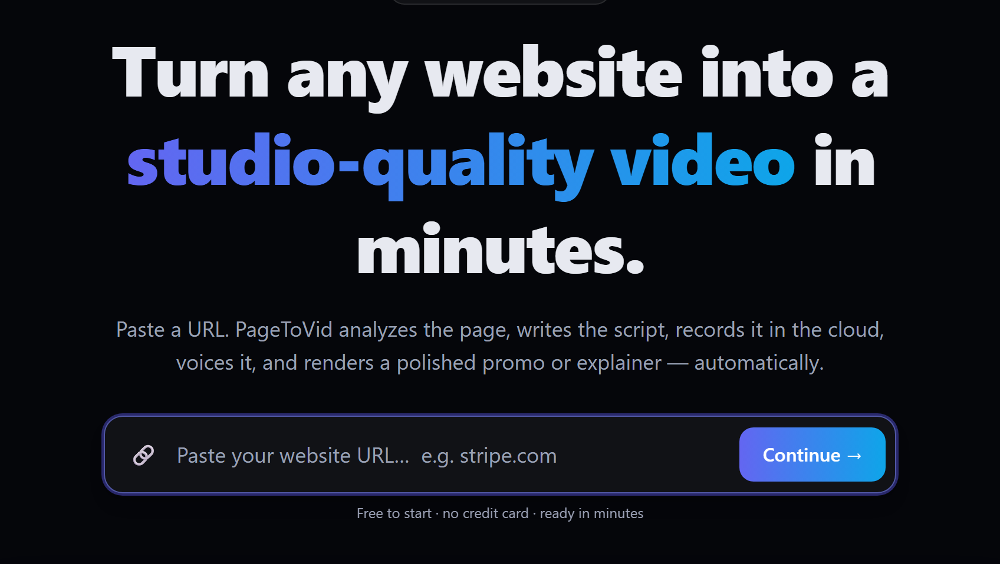
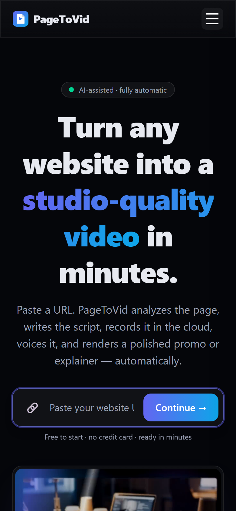
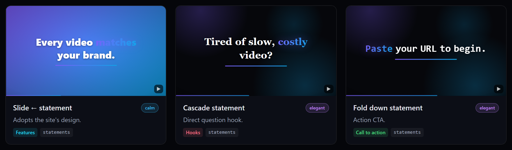

# Getting started
{: .no_toc }

Your first film in about three minutes, in the web app. A free account starts with 120 credits —
three films — and a website's free allowance is three films across all free accounts.
{: .fs-5 .fw-300 }

1. TOC
{:toc}

## 1. Paste a link

Open [pagetovid.com](https://pagetovid.com), paste the address of any **public** page and press
**Continue**. PageToVid opens the page in a real browser, reads it, and writes a storyboard: one
idea per scene, each either filmed on the site or drawn as a motion graphic.

It works the same way on a phone:

{: width="300" }

{: .tip }
Point it at the page that shows the **product** — a listing, a search box, a pricing table — rather
than a marketing hero. A film of a hero section is a film of a headline.

## 2. Choose the shape and the look

Pick the format before you start, because it changes what is filmed:

| Aspect | Films | Use it for |
|---|---|---|
| **16:9** | the site's desktop layout | YouTube, websites, presentations |
| **9:16** | the site's own *mobile* layout, in a phone viewport | Reels, Shorts, TikTok |
| **1:1** | the desktop layout, square | social feeds |

A **look** sets the captions, the cutting rhythm, the sound cues and the motion register together:
`clean`, `bold`, `editorial`, `playful` or `tech`. Every setting it implies can be changed on its own
later in the editor's **Style** panel: caption style and animation, colour grade, sound level, the
cursor, the callout drawn over a click, what a click does to the picture, and the closing card.

## 3. Watch it render, then read it

Rendering takes a few minutes. When it finishes, the project page plays the film, lists any
**warnings** in plain sentences, and shows the storyboard scene by scene. A film can finish and still
not be whole — a generated visual that failed, a scene held for less time than its words — so read
the warnings before you publish.

Every film gets a public page with a player, a share bar, an embed code and an MP4 download, at
`https://pagetovid.com/watch/<title>-<id>`.

## 4. Edit without starting over

In the editor you can rewrite what a scene says, change how it is drawn, re-point the camera at a
specific element of the page, reorder, trim, and change the voice or the music. The live preview
updates as you type; **Render** makes the new film from the edited storyboard for 40 credits.

The scenes can be drawn as any of the animation templates, each previewed live in the
[catalogue](https://pagetovid.com/animations):

## 5. Pages behind a login

Dashboards and apps behind a sign-in are filmed through the
[browser extension](https://pagetovid.com/extension) or the VS Code extension: you sign in yourself,
the extension registers a capture session for that one site, and it expires within three days. No
password ever reaches PageToVid.

## Plans and credits

A rendered film costs **40 credits**. On paid plans an AI still costs 40 credits and the house AI
clip 311; a clip from a model you name is priced from what it costs — see
[Credits & pricing](pricing) for the full table and worked examples. A render that fails is refunded
in full, AI visuals included.

| Plan | Monthly | Billed yearly | Credits a month | Films a month | For |
|---|---|---|---|---|---|
| **Free** | $0 | — | 120 once, at sign-up | 3 | trying it, no card needed |
| **Starter** | $19 | $190 | 1,000 | 25 | solo creators and founders |
| **Pro** | $49 | $490 | 3,000 | 75 | marketers and small teams |
| **Scale** | $99 | $990 | 8,000 | 200 | growing teams and high volume |
| **Business** | $299 | $2,990 | 30,000 | 750 | brands producing every week |
| **Agency** | $999 | $9,990 | 110,000 | 2,750 | agencies running many brands |

Beyond that, **Enterprise** starts at $2,500 a month with custom volume, invoicing and a named
contact: write to [hello@pagetovid.com](mailto:hello@pagetovid.com).

One-off credit packs, which never expire: 40 credits $3.90 · 400 credits $29 · 2,000 credits $119 ·
8,000 credits $399. Current prices and features: [pagetovid.com/pricing](https://pagetovid.com/pricing).
