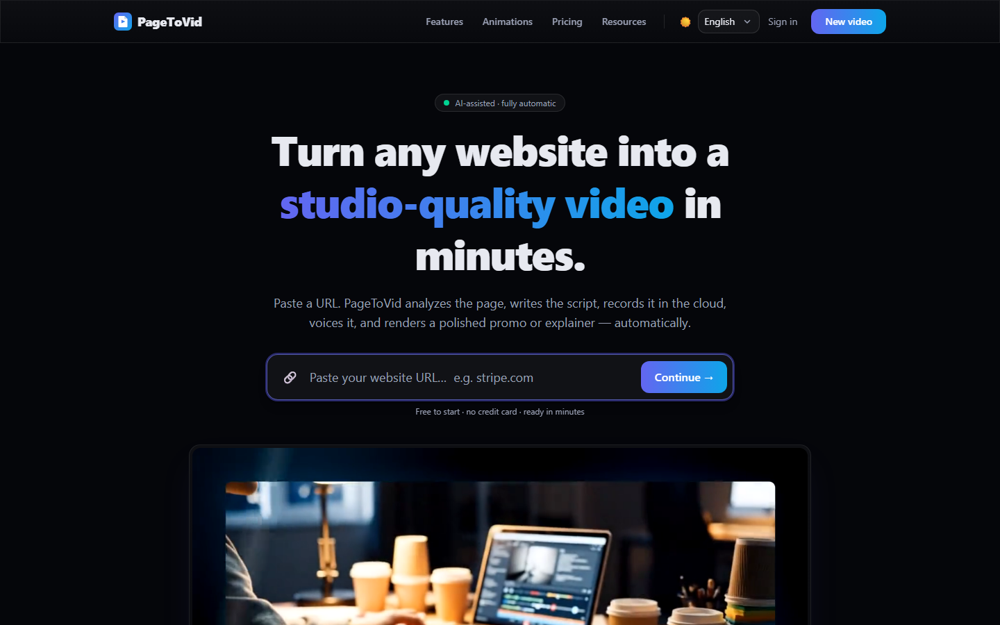
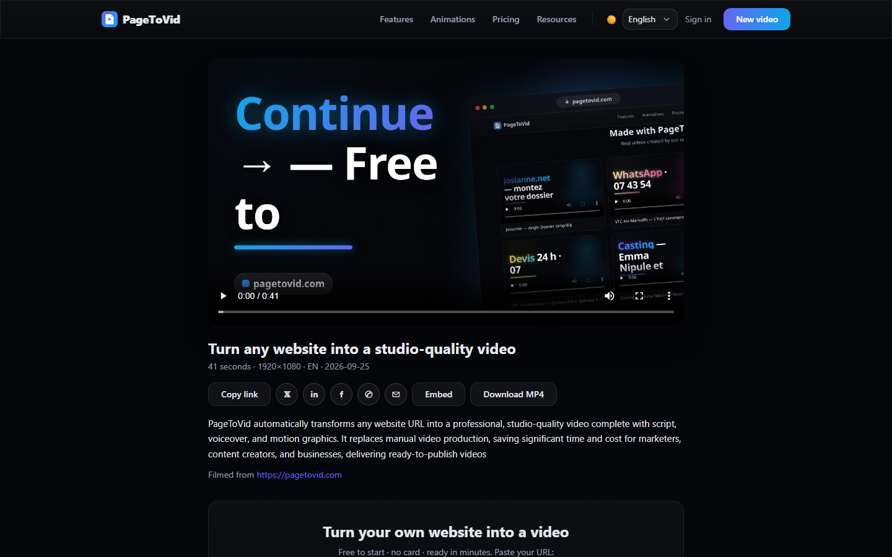
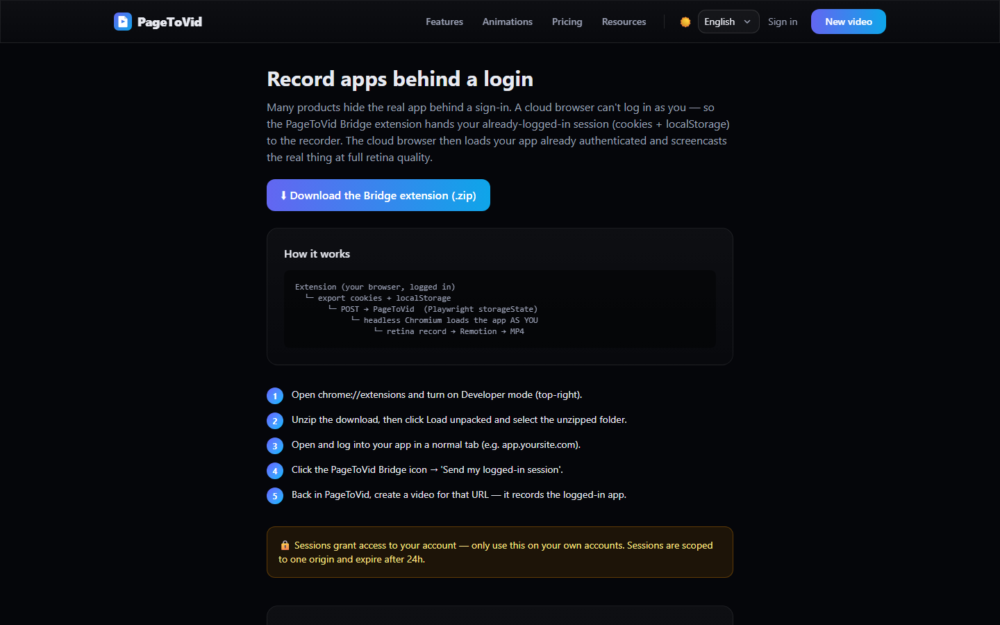
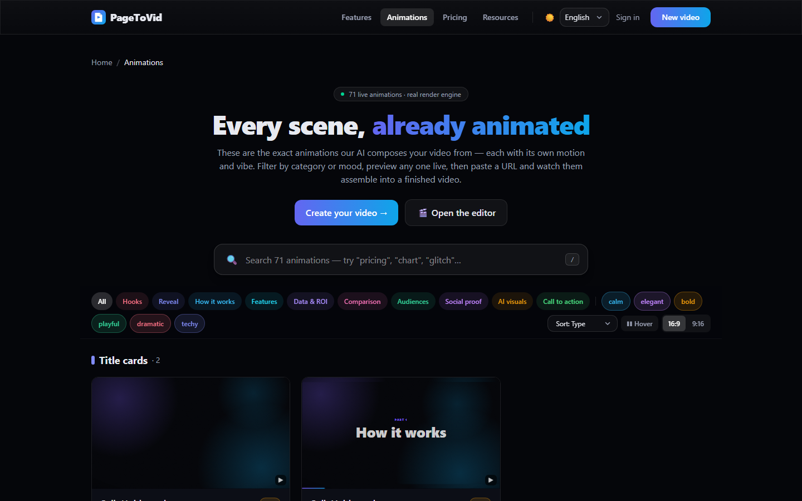
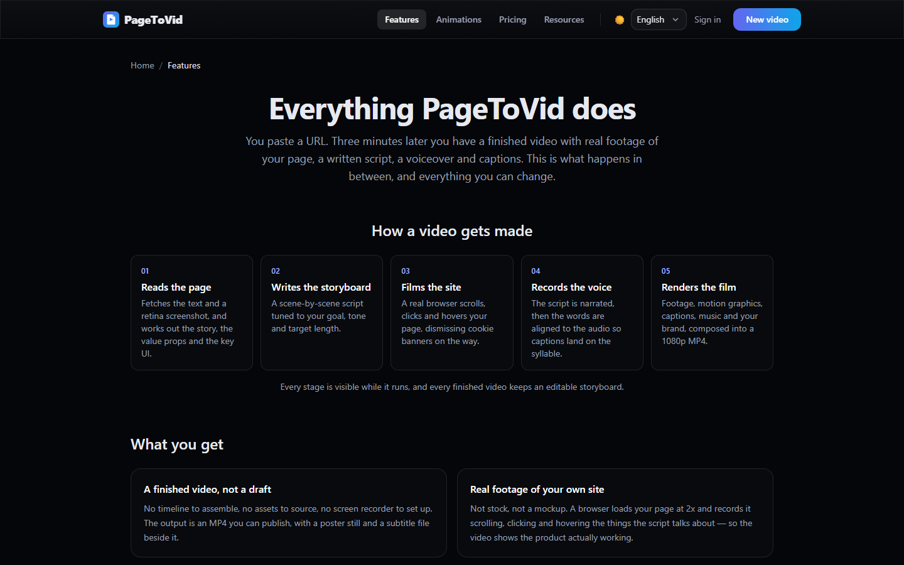
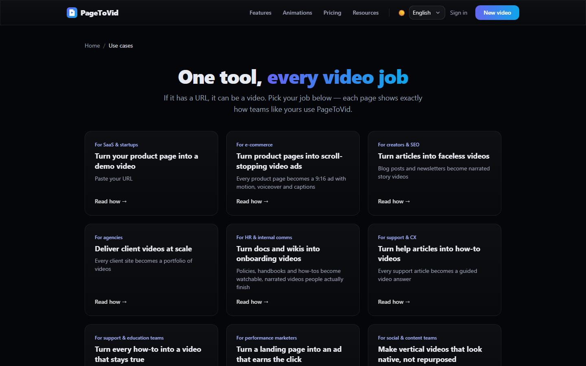
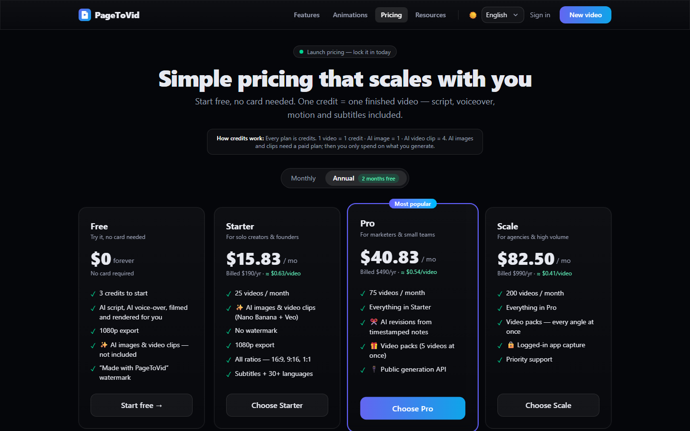

# Getting started
{: .no_toc }

Your first film in about three minutes, in the web app. No account is needed to see the product;
a free account makes three films per website.
{: .fs-5 .fw-300 }

1. TOC
{:toc}

## 1. Paste a link

Open [pagetovid.com](https://pagetovid.com), paste the address of any **public** page and press
**Continue**. PageToVid opens the page in a real browser, reads it, and writes a storyboard: one
idea per scene, each either filmed on the site or drawn as a motion graphic.

On a phone the same page works the same way:

{: width="320" }

{: .tip }
Point it at the page that shows the **product** — a listing, a search box, a pricing table — rather
than a marketing hero. A film of a hero section is a film of a headline.

## 2. Choose the shape and the look

Pick the format before you start, because it changes what is filmed:

| Aspect | Films | Use it for |
|---|---|---|
| **16:9** | the site's desktop layout | YouTube, websites, presentations |
| **9:16** | the site's own *mobile* layout, in a phone viewport | Reels, Shorts, TikTok |
| **1:1** | the desktop layout, square | social feeds |

A **look** sets the captions, the cutting rhythm, the sound cues and the motion register together —
*clean, bold, editorial, playful* or *tech*. Every setting it implies can be changed on its own later
in the editor's **Style** panel.

## 3. Watch it render, then read it

Rendering takes a few minutes. When it finishes, the project page plays the film, lists any
**warnings** in plain sentences, and shows the storyboard scene by scene. A film can finish and still
not be whole — a generated visual that failed, a scene held for less time than its words — so read
the warnings before you publish.

Every film gets a public page you can share, embed, or download as an MP4:

## 4. Edit without starting over

In the editor you can rewrite what a scene says, change how it is drawn, re-point the camera at a
specific element of the page, reorder, trim, and change the voice or music. The live preview updates
as you type; **Render** makes the new film from the edited storyboard (one credit).

## 5. Pages behind a login

Dashboards and apps behind a sign-in are filmed through the
[browser extension](https://pagetovid.com/extension): you sign in yourself, the extension registers
a capture session for that one site, and it expires within three days.

## A quick tour

**71 animation templates**, each previewable live — the visuals a scene can be drawn as:

**Features** — everything a film can carry, from kinetic captions to AI clips:

**Use cases** — films made for SaaS, local businesses, e-commerce and more:

## Pricing in one line

One credit is one rendered film. Generated AI images cost one credit and generated clips four, on
paid plans; a render that fails for a system reason is refunded automatically.
[See the plans](https://pagetovid.com/pricing).

