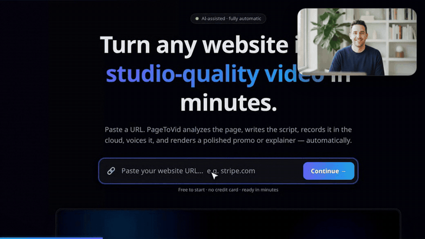

# A presenter in the corner
{: .no_toc }

The arrangement every screen tutorial uses: the product filmed full-screen, and a person in the
corner talking about it. In PageToVid the person is a generated clip drawn **over** the scene rather
than instead of it, and it works on a filmed scene and a drawn one alike.
{: .fs-5 .fw-300 }

<video controls preload="none" width="100%" poster="https://pagetovid.com/v/cmuhbqb8d0005s61wa99buvkd.jpg">
  <source src="https://pagetovid.com/v/cmuhbqb8d0005s61wa99buvkd.mp4" type="video/mp4">
</video>

1. TOC
{:toc}

## 1. Create the character

A [character](characters) keeps the same face in every clip of a film. Draw its reference portrait
once (40 credits, the price of one still — or free from images you already have):

```text
create_character
  name:        "Sam, the PageToVid host"
  generate:    "A friendly man in his early thirties, short dark hair, light stubble, navy
                crew-neck sweater, at a desk in a bright home office, looking into the camera"
  description: "Sam, a friendly man in his early thirties … talking to camera like a YouTuber."
```

{: width="256" }

## 2. Direct the shots

Make each scene a different part of the product, and make most of them **do** something — typing
into the real search box, clicking the real button. Use selectors from `inspect_page`.

```text
update_storyboard  video_id: …
  set_shot  scene 2  selector: <the URL field>        action: type   text: "stripe.com"
  set_shot  scene 3  selector: <the Continue button>  action: click
  set_shot  scene 4  selector: <the search box>       action: type   text: "pricing"
                     page_url: https://pagetovid.com/animations
```

## 3. Let the presenter speak — no narrator

Give each scene **empty narration** and a presenter whose line is in quotation marks. The presenter's
own voice becomes the soundtrack; each scene holds until his last word, measured from the clip, plus
a breath.

```text
update_storyboard  video_id: …
  rewrite_narration  scene 2  narration: ""
  set_inset  scene 2
    character: "Sam, the PageToVid host"
    size:      0.28
    generate:  "Sam at his desk, talking to camera, glancing at his screen.
                He says: \"Step one: paste a link. I'll use Stripe.\""
```

Then `rerender_video`. That is the whole recipe for the film above.

## `set_inset` settings

Every field is optional, and nothing here can refuse a render: an out-of-range value is adjusted,
never rejected.

| Field | Effect |
|---|---|
| `generate` | The shot, as you would describe it. A line in quotation marks is said out loud. `null` removes the presenter. |
| `character` | A `create_character` name, so the same face recurs. |
| `model` | Which model makes the clip, e.g. `seedance-2.0-mini`. Omitted: the house clip (Veo 3.1 Fast). See [AI models](ai-models). |
| `corner` | `bottom-right`, `bottom-left`, `top-right`, `top-left`. **Omit it** and the corner that keeps clear of what the shot is about is chosen — the button being clicked, the field being typed into — both before the camera moves and where it settles. A corner you name is kept even if it covers something, and the render says so. |
| `shape` | `rounded` (the whole clip), `circle` (a talking head — needs a close-up), `square`. |
| `size` | Width as a share of the frame, 0.14–0.42. Default 0.26. |
| `mute` | The face without the voice. By default a scene with no narration lets the presenter carry it, and a narrated one drops him to a bed under the narrator. |

## What it costs

A presenter is one generated clip per scene, charged when it is made and refunded if it fails (the
scene then plays without the presenter):

- **House clip** (no `model`): 311 credits.
- **A named model**: its per-second price at the model's **cheapest** resolution — a presenter is drawn
  at a quarter of the width, where the difference never shows. A 6-second presenter on
  `seedance-2.0-mini` is 94 credits.

Ask first, free:

```json
{ "name": "quote_cost",
  "arguments": { "kind": "clip", "model": "seedance-2.0-mini", "role": "inset", "duration_s": 6 } }
```

The presenter's clip is reused on later renders at no charge; moving it (`corner`, `size`, `shape`)
never regenerates it. Changing `generate` or `character` makes a new one. Every price is in
[Credits & pricing](../pricing).

## What the layout guarantees

These are enforced by the renderer and covered by tests, not left to chance:

- **Inside the frame**, in every aspect ratio and at any size.
- **Clear of the captions** — including when a caption is lifted above a low subject.
- **Clear of the watermark** on a free plan.
- **Never stretched**: the clip keeps its own shape; a circle crops a square so a face is not squeezed.
- **Never cut off mid-sentence** in a scene with no narration.


